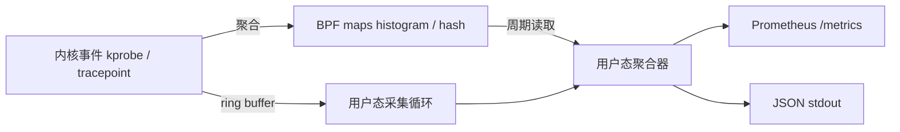

# 设计文档

## 背景与问题

`top` / `iostat` 给出的是平均值，看不到延迟分布与长尾；排查线上抖动时需要"每次调用"级别的数据。eBPF 可以在内核态无侵入地采集，但临时脚本无法长期运行、无法导出指标。

## 目标

1. 采集若干类关键内核事件，在内核态尽量聚合，降低开销
2. 以 Prometheus 文本格式导出，接入 Grafana
3. 可配置、可热重载、可长期运行（守护进程）

## 非目标

- 不写自研 Web UI（交给 Grafana）
- 不做多机分布式与告警引擎
- 不写内核模块（纯 eBPF + 用户态）

## 架构

## 关键决策

| 决策 | 选择 | 理由 |
|---|---|---|
| 框架 | libbpf + CO-RE | 可移植、无运行时编译；BCC 依赖重、可移植性差 |
| 事件通道 | ring buffer | 相比 perf buffer 无 per-CPU 乱序、内存占用可控 |
| 聚合位置 | 尽量在内核态（histogram map） | 把开销从 O(每次调用) 降到 O(采样周期) |
| 导出格式 | Prometheus 文本 | 直接对接 Grafana，不自己写 UI |

## 里程碑

- [x] M1 环境打通：vmlinux.h + BPF 编译 + skeleton + 加载运行
- [x] M2 第一个采集器：openat
- [ ] M3 块 IO 延迟直方图
- [ ] M4 Prometheus 导出（复用 epoll HTTP 服务）
- [ ] M5 配置热重载 + 守护进程化
- [ ] M6 测试、CI、文档、演示
